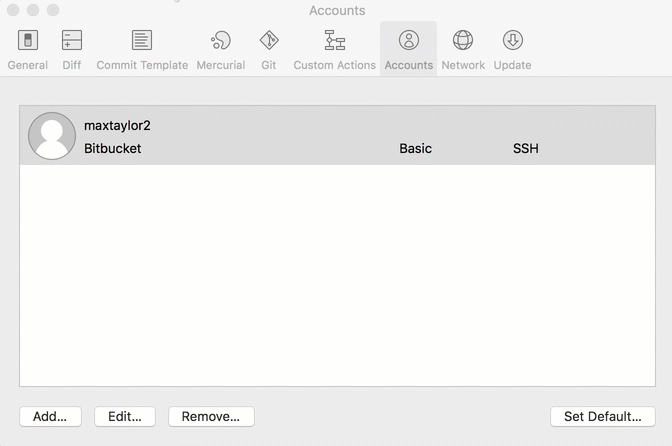

# 使用不同 ssh 金鑰登入 github

在 github 抓取 Repository 時，我們常常用 git ssh 帳號去 clone 一個 Repository，像是：

```
git clone git@github.com:laravel/laravel.git
```

而使用 ssh 去 clone Repository 時，則會需要 `ssh 金鑰` 才能夠順利的將專案複製下來，但只要有正確的金鑰，我們在每一次對 Repository 進行 clone / push / pull / fetch 的時候，則都不需要輸入帳號密碼即可完成操作（只要你的帳號有足夠的權限的話）

但當我們有個人的專案及公司的專案都在 github 時，且不同的專案所需要的 `ssh 金鑰` 皆不同時，則需要設定在不同的狀況需要使用不同的金鑰去存取我們的 Repository。

例如 `git@github.com:kj/kj.git` 需要 `id_rsa_kj_personal` 的金鑰，但 `git@github.com:kj-company/compony-project.git` 則需要 `id_rsa_kj_company` 的金鑰

此時可以使用的解法有下列 2 個

## 設定 .ssh/config 檔案

`.ssh/config` 的設定檔案格式像下方

```
Host <host_alias>                       # 主機別名
    HostName <hostname_or_ip>           # 主機網址或 ip
    IdentityFile <private_key_path>     # 金鑰位置
```

所以我們可以將 `.ssh/config` 檔案設定成這樣

```ssh
# GitHub KJ 個人專案
Host github-kj-personal
    HostName github.com
    IdentityFile ~/.ssh/id_rsa_kj_personal

# GitHub KJ 公司專案
Host github-kj-company
    HostName github.com
    IdentityFile ~/.ssh/id_rsa_kj_company
```

設定完 `.ssh/config` 之後

在存取個人專案的網址會從 `git@github.com:kj/kj.git` 改成 `git@github-kj-personal:kj/kj.git`

在存取公司專案的網址會從 `git@github.com:kj-company/compony-project.git` 改成 `git@github-kj-company:kj-company/compony-project.git`

所以複製專案指令會變成

```
git clone git@github-kj-personal:kj/kj.git
git clone git@github-kj-company:kj-company/compony-project.git
```


下列是 git ssh 網址格式說明，所以可以看到我們用 `主機別名 Host <host_alias>` 將原本的主機名稱改掉

```ssh
# 原始網址
git@github.com:<accountname>/<reponame>.git

# 網址格式
git@<host_alias>:<accountname>/<reponame>.git
```

當我們存取 `github-kj-personal` 主機時，根據 `.ssh/config` 設定，我們會存取到設定的 `HostName` 為 `github.com`，使用的金鑰為 `~/.ssh/id_rsa_kj_personal`

當我們存取 `github-kj-company` 主機時，根據 `.ssh/config` 設定，我們會存取到設定的 `HostName` 為 `github.com`，使用的金鑰為 `~/.ssh/id_rsa_kj_company`

所以這樣設定可以讓我們同時對 github 使用不同的金鑰進行存取


## 加入臨時的 ssh 金鑰


在需要存取公司的 Repository 時，可以將公司的 ssh key 加入，這樣在一段時間內都可以使用此金耀進行存取

在 .bash_profile 可以設定指令的快捷

```shell
alias ssh-set-company-key='export GIT_SSH_COMMAND="ssh -i ~/.ssh/COMPANY_KEY";
                           export PS1="${PS1}COMPANY ==> "'
```

設定完指令 alias 後，之後需要使用到公司的金鑰時，就可以輸入此指令，就可以存取公司專案了

## 在 SourceTree 指定不同的金鑰




1. 在選單選擇 `Preferences`
2. 點選 `Accounts` 頁籤，建立帳號
3. 按住 `Option` 按鈕並產生新的 ssh key
4. 建立完成專用的 ssh key 後，將 ssh key 的 public 設定至 github 或 bitbucket 即可


# 參考資料
* [如何用config管理多個網站的ssh key和如何不用每一組輸入ssh的Pass Phrase @ Alan Tsai 的學習筆記｜An Asp .Net Mvc Web Developer Blog](https://blog.alantsai.net/posts/2016/03/ssh-config-ssh-agent-passphrase-management)
* [How to setup SSH config ：使用 SSH 設定檔簡化指令與連線網址 - 浦島太郎的水族缸 - Medium](https://medium.com/%E6%B5%A6%E5%B3%B6%E5%A4%AA%E9%83%8E%E7%9A%84%E6%B0%B4%E6%97%8F%E7%BC%B8/how-to-setup-ssh-config-%E4%BD%BF%E7%94%A8-ssh-%E8%A8%AD%E5%AE%9A%E6%AA%94-74ad46f99818)
* [Set up an SSH key - Atlassian Documentation](https://confluence.atlassian.com/bitbucket/set-up-an-ssh-key-728138079.html)
* [多重 SSH Keys 與 Github 帳號 | 東北角的小徑](https://kuanyui.github.io/2016/08/01/git-multiple-ssh-key/)
* [OpenSSH Config File Examples - nixCraft](https://www.cyberciti.biz/faq/create-ssh-config-file-on-linux-unix/)
* [What's the difference between Host and HostName in SSH Config? - Super User](https://superuser.com/questions/503687/whats-the-difference-between-host-and-hostname-in-ssh-config/1207305)
* [Best way to use multiple SSH private keys on one client - Stack Overflow](https://stackoverflow.com/questions/2419566/best-way-to-use-multiple-ssh-private-keys-on-one-client)
* [How to manage multiple SSH key pairs | Enable Sysadmin](https://www.redhat.com/sysadmin/manage-multiple-ssh-key-pairs)
* [Multiple SSH keys for different github accounts · GitHub](https://gist.github.com/jexchan/2351996)
