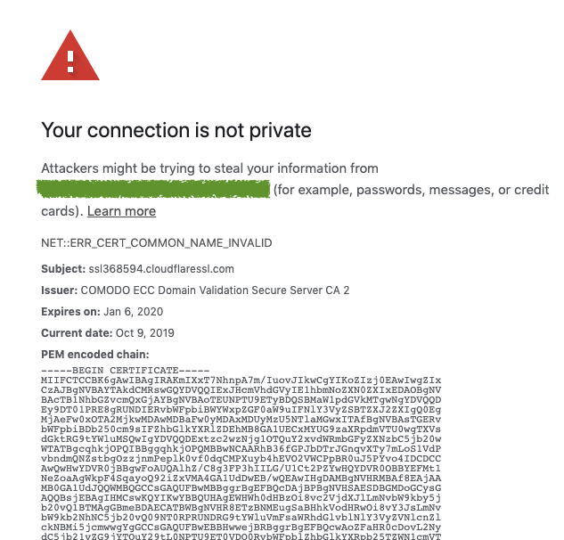
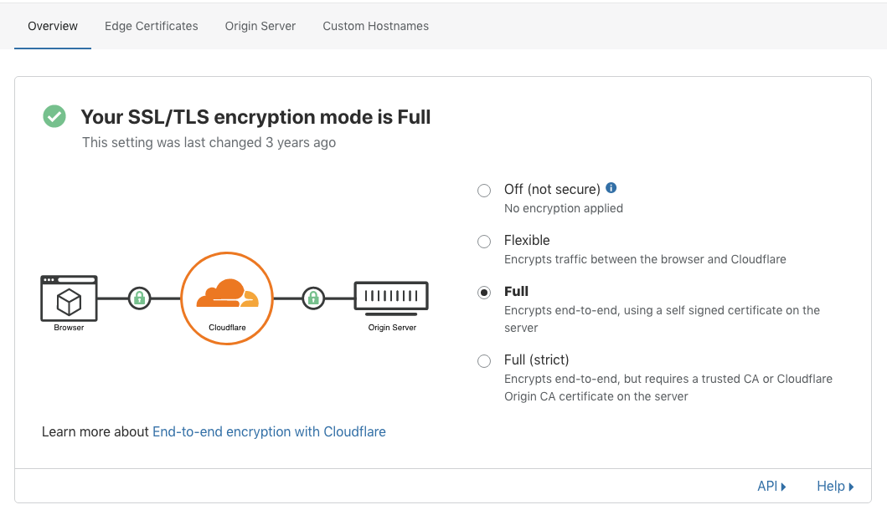
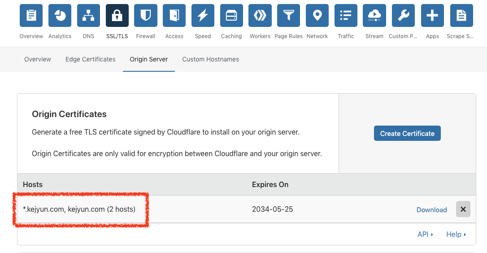

# NET::ERR_CERT_COMMON_NAME_INVALID

在設定使用 cloudflare 的憑證時，發生了 `NET::ERR_CERT_COMMON_NAME_INVALID` 的錯誤訊息

```
Your connection is not private
Attackers might be trying to steal your information from xxx.yyy.kejyun.com (for example, passwords, messages, or credit cards). Learn more
NET::ERR_CERT_COMMON_NAME_INVALID
Subject: ssl368594.cloudflaressl.com

Issuer: COMODO ECC Domain Validation Secure Server CA 2

Expires on: Jan 6, 2020

Current date: Oct 9, 2019

PEM encoded chain:
```




因為測試的關係，所以需要建立一台 `kj.test.kejyun.com` 的網址連限制至後方主機，後方主機完全沒有經過 Cloudflare，是使用 Let's Encrypt 取得可以正常使用的憑證，而 Let's Encrypt 發送的憑證是給 `kj.test.kejyun.com`

而之後要使用 Cloudflare 的憑證做測試，因為 Cloudflare 憑證的驗證方式是 `Full` 的方式，所以 cloudflare 會驗證後方主機的憑證是否正常





但此時因為後方的主機憑證是配發給 `kj.test.kejyun.com`，而 cloudflare 的憑證是配發給 `*.kejyun.com`，所以 cloudflare 在驗證憑證時發生不匹配的狀況，所以才會出現 `NET::ERR_CERT_COMMON_NAME_INVALID` 的錯誤訊息



## 解決方式

1. 上傳 `kj.test.kejyun.com` 的憑證至 cloudflare
2. 不要使用過多的子網域當作測試網址，可以使用 `kj.kejyun.com` 當作測試網址即可通過憑證驗證
